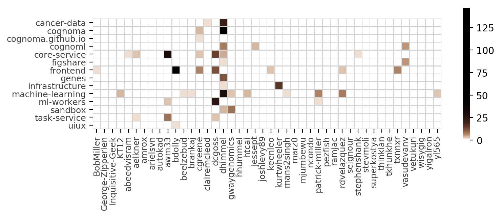

# Project Cognoma

_Putting machine learning in the hands of cancer biologists._

Project Cognoma is an open source project to create a webapp for analyzing cancer data.
We're a community-driven philanthropic project that began as a collaboration between the [Greene Lab](http://www.greenelab.com/ "Greene Lab at Penn"), [DataPhilly](https://www.meetup.com/DataPhilly/ "DataPhilly Meetup"), and [Code for Philly](https://codeforphilly.org/ "Code for Philly").
Our contributors are primarily based in the Philadelphia area, but anyone anywhere is welcome.
This GitHub repository is the administrative and informational home of Cognoma.

The Meetup phase of Cognoma is now complete!
The [Childhood Cancer Data Lab](https://www.ccdatalab.org/) of [Alex's Lemonade Stand Foundation](https://www.alexslemonade.org/) will be providing longterm maintenance.
Public **contributions are still welcome** through GitHub.
The main priority is enhancements and bug fixes to improve http://cognoma.org.
For a nice overview of the project, see its [coverage by The Philadelphia Citizen](http://thephiladelphiacitizen.org/code-for-cancer/ "Code for Cancer by Roxanne Shepelavy. Philadelphia Citizen. 2017-10-25").

## Teams and Repositories

The project is composed of four teams with their own corresponding repositories:

| Team Name | Repositories | Description |
|-----------|--------------|-------------|
| Cancer Data | [`cancer-data`](https://github.com/cognoma/cancer-data), [`genes`](https://github.com/cognoma/genes), [`figshare`](https://github.com/cognoma/figshare) | processing the underlying cancer data to the formats required for this project. |
| Machine Learning | [`machine-learning`](https://github.com/cognoma/machine-learning), [`cognoml`](https://github.com/cognoma/cognoml) | building classifiers to predict mutation status from gene expression data. |
| Backend | [`core-service`](https://github.com/cognoma/core-service), [`task-service`](https://github.com/cognoma/task-service), [`ml-workers`](https://github.com/cognoma/ml-workers), [`infrastructure`](https://github.com/cognoma/infrastructure) | creating the infrastructure to power the webapp and glue the components together. |
| Frontend | [`frontend`](https://github.com/cognoma/frontend), [`uiux`](https://github.com/cognoma/uiux) | building the webapp that users interact with. |

## New Here?

If you are a new user and would like to get involved, please [introduce yourself](https://github.com/cognoma/cognoma/issues/2 "Issue #2: Introduce yourself here to get involved").
Contributions are made through GitHub, so if you are unfamiliar with git or GitHub, check out the [`sandbox`](https://github.com/cognoma/sandbox) for a place to learn by doing.

## Meetup Schedule

We hold project meetups.
Our usual meeting spot is at Industrious (where CandiDate is located).
The address is [230 S Broad St, Floor 17, Philadelphia](https://goo.gl/maps/Anoo4SUE9At "Google Maps").

| 📅 Date | ⌚ Time | 🗺 Location | ℹ️ Meetup Details | 💰 Sponsor |
|--------|---------|-----------|-----------|-------------|
| ~~Wednesday, October 11, 2017~~ | 6:00 PM | [MilkBoy](http://www.milkboyphilly.com/) | [DataPhilly](https://www.meetup.com/DataPhilly/events/243724362/) | [Alex’s Lemonade Stand Foundation](https://www.alexslemonade.org/) |
| ~~Tuesday, August 15, 2017~~ | 6:00 PM | [CandiDate](http://www.candidatephilly.com/) | [DataPhilly](https://www.meetup.com/DataPhilly/events/241916652/) | [Penn Institute for Biomedical Informatics](http://upibi.org/) |
| ~~Tuesday, July 11, 2017~~ | 6:00 PM | [CandiDate](http://www.candidatephilly.com/) | [DataPhilly](https://www.meetup.com/DataPhilly/events/241172890/) | [Penn Institute for Biomedical Informatics](http://upibi.org/) |
| ~~Tuesday, June 27, 2017~~ | 6:00 PM | [CandiDate](http://www.candidatephilly.com/) | [DataPhilly](https://www.meetup.com/DataPhilly/events/240560903/) | [Penn Institute for Biomedical Informatics](http://upibi.org/) |
| ~~Tuesday, May 30, 2017~~ | 6:00 PM | [CandiDate](http://www.candidatephilly.com/) | [DataPhilly](https://www.meetup.com/DataPhilly/events/239701435/) | [Penn Institute for Biomedical Informatics](http://upibi.org/) |
| ~~Tuesday, April 25, 2017~~ | 6:00 PM | [CandiDate](http://www.candidatephilly.com/) | [DataPhilly](https://www.meetup.com/DataPhilly/events/239416274/) | [Penn Institute for Biomedical Informatics](http://upibi.org/) |
| ~~Tuesday, April 4, 2017~~ | 6:00 PM | [CandiDate](http://www.candidatephilly.com/) | [DataPhilly](https://www.meetup.com/DataPhilly/events/238698413/) | [Penn Institute for Biomedical Informatics](http://upibi.org/) |
| ~~Tuesday, February 28, 2017~~ | 6:00 PM | [CandiDate](http://www.candidatephilly.com/) | [DataPhilly](https://www.meetup.com/DataPhilly/events/237710256/) | [Penn Institute for Biomedical Informatics](http://upibi.org/) |
| ~~Monday, February 13, 2017~~ | 6:00 PM | [CandiDate](http://www.candidatephilly.com/) | [DataPhilly](https://www.meetup.com/DataPhilly/events/237369158/) | [Penn Institute for Biomedical Informatics](http://upibi.org/) |
| ~~Tuesday, January 31, 2017~~ | 6:00 PM | [CandiDate](http://www.candidatephilly.com/) | [DataPhilly](https://www.meetup.com/DataPhilly/events/237148044/) | [Penn Institute for Biomedical Informatics](http://upibi.org/) |
| ~~Monday, January 16, 2017~~ | 9:00 AM | Philly Think Space | [Frontend Only](https://codeforphilly.org/blog/mlk_day_of_service_with_think_company) | MLK Day Volunteers from [Think Company](https://www.thinkcompany.com/) |
| ~~Tuesday, January 10, 2017~~ | 6:00 PM | [CandiDate](http://www.candidatephilly.com/) | [DataPhilly](https://www.meetup.com/DataPhilly/events/236382207/) | [Penn Institute for Biomedical Informatics](http://upibi.org/) |
| ~~Tuesday, December 20, 2016~~ | 6:00 PM | [CandiDate](http://www.candidatephilly.com/) | [DataPhilly](https://www.meetup.com/DataPhilly/events/236118502/) | [Penn Institute for Biomedical Informatics](http://upibi.org/) |
| ~~Tuesday, December 6, 2016~~ | 6:00 PM | [CandiDate](http://www.candidatephilly.com/) | [DataPhilly](https://www.meetup.com/DataPhilly/events/235882962/) | [Penn Institute for Biomedical Informatics](http://upibi.org/) |
| ~~Tuesday, November 15, 2016~~ | 6:00 PM | [CandiDate](http://www.candidatephilly.com/) | [DataPhilly](https://www.meetup.com/DataPhilly/events/235299731/) | [Penn Institute for Biomedical Informatics](http://upibi.org/) |
| ~~Tuesday, November 1, 2016~~ | 6:00 PM | [CandiDate](http://www.candidatephilly.com/) | [DataPhilly](https://www.meetup.com/DataPhilly/events/234971229/) | [Penn Institute for Biomedical Informatics](http://upibi.org/) |
| ~~Tuesday, October 18, 2016~~ | 6:00 PM | [CandiDate](http://www.candidatephilly.com/) | [DataPhilly](https://www.meetup.com/DataPhilly/events/234676933/) | [Penn Institute for Biomedical Informatics](http://upibi.org/) |
| ~~Tuesday, October 4, 2016~~ | 6:00 PM | [CandiDate](http://www.candidatephilly.com/) | [DataPhilly](https://www.meetup.com/DataPhilly/events/234268259/) | [Penn Institute for Biomedical Informatics](http://upibi.org/) |
| ~~Monday, September 19, 2016~~ | 6:00 PM | [CandiDate](http://www.candidatephilly.com/) | [DataPhilly](https://www.meetup.com/DataPhilly/events/234124464/) | [Penn Institute for Biomedical Informatics](http://upibi.org/) |
| ~~Tuesday, September 6, 2016~~ | 6:00 PM | [CandiDate](http://www.candidatephilly.com/) | [DataPhilly](https://www.meetup.com/DataPhilly/events/233403039/) | [Penn Institute for Biomedical Informatics](http://upibi.org/) |
| ~~Tuesday, August 23, 2016~~ | 6:00 PM | [CandiDate](http://www.candidatephilly.com/) | [DataPhilly](https://www.meetup.com/DataPhilly/events/233403001/) | [Penn Institute for Biomedical Informatics](http://upibi.org/) |
| ~~Tuesday, August 9, 2016~~ | 6:00 PM | [CandiDate](http://www.candidatephilly.com/) | [DataPhilly](https://www.meetup.com/DataPhilly/events/233070705/) | [Penn Institute for Biomedical Informatics](http://upibi.org/) |
| ~~Tuesday, July 26, 2016~~ | 6:00 PM | [CandiDate](http://www.candidatephilly.com/) | [DataPhilly](https://www.meetup.com/DataPhilly/events/232785717/) | [Penn Institute for Biomedical Informatics](http://upibi.org/) |
| ~~Tuesday, July 19, 2016~~ | 6:00 PM | [CandiDate](http://www.candidatephilly.com/) | [DataPhilly](https://www.meetup.com/DataPhilly/events/232591931/) | [Penn Institute for Biomedical Informatics](http://upibi.org/) |
| ~~Tuesday, July 12, 2016~~ | 6:00 PM | [CandiDate](http://www.candidatephilly.com/) | [DataPhilly](https://www.meetup.com/DataPhilly/events/232470548/) | [MilkBoy](http://www.milkboyphilly.com/) |
| ~~Tuesday, July 5, 2016~~ | 6:00 PM | [CandiDate](http://www.candidatephilly.com/) | [DataPhilly](https://www.meetup.com/DataPhilly/events/232137908/) | [Neo Technology](https://neo4j.com/) |
| ~~Tuesday, June 28, 2016~~ | 6:00 PM | [MilkBoy](http://www.milkboyphilly.com/) | [DataPhilly](https://www.meetup.com/DataPhilly/events/230814092/) / [Code for Philly](http://www.meetup.com/Code-for-Philly/events/230802415/) | [MilkBoy](http://www.milkboyphilly.com/) |

## Contributing

Community contributions are the driving force behind Cognoma.
The heatmap below shows which users have contributed to which repositories:

 

See the [guidelines for contributing](CONTRIBUTING.md) for more information.

## Maintainers

Cognoma relies on our generous community maintainers to assist with contributions.
Thanks to the following maintainers for their help:

+ **Cancer Data**:
Claire McLeod ([@**clairemcleod**](https://github.com/clairemcleod))
+ **Machine Learning**:
Patrick Miller ([@**patrick-miller**](https://github.com/patrick-miller)),
Ryan Velazquez ([@**rdvelazquez**](https://github.com/rdvelazquez)),
Jesse Prestwood-Taylor ([@**jessept**](https://github.com/jessept)),
Yichuan Liu ([@**yl565**](https://github.com/yl565))
+ **Backend**:
Derek Goss ([@**dcgoss**](https://github.com/dcgoss)),
Andrew Madonna ([@**awm33**](https://github.com/awm33)),
Kurt Wheeler ([@**kurtwheeler**](https://github.com/kurtwheeler))
+ **Frontend**:
Benjamin Dolly ([@**bdolly**](https://github.com/bdolly))
+ **Community**:
Karin Wolok ([@**KarinSpiderwoman**](https://github.com/KarinSpiderwoman))
+ **Wildcards**:
Daniel Himmelstein ([@**dhimmel**](https://github.com/dhimmel)),
Gregory Way ([@**gwaygenomics**](https://github.com/gwaygenomics)),
Casey Greene ([@**cgreene**](https://github.com/cgreene))
